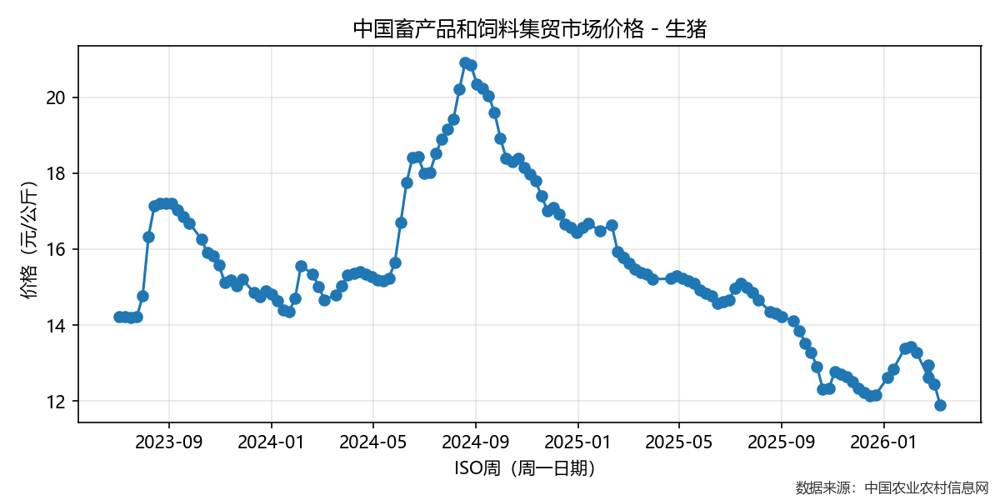
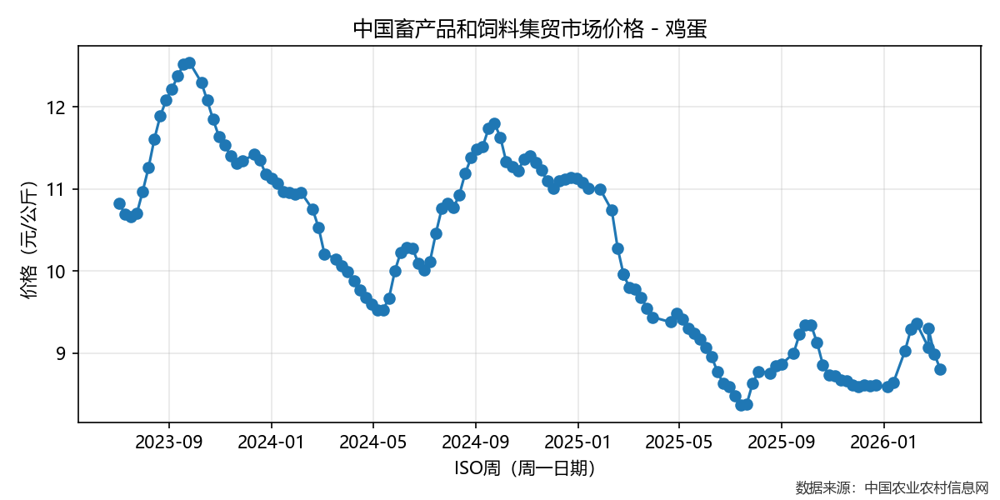

# 中国农业农村信息网价格监测

本项目用于抓取中国农业农村信息网“监测预警”栏目中的**畜产品和饲料集贸市场价格情况**，并做增量更新与可视化。

## 图表示例
下面是仓库里的两张代表性图表，推到 GitHub 后可以直接在 README 中展示：




## 目录结构
- `scripts/` 脚本（按编号顺序）
- `data/` SQLite 数据库
- `charts/` 生成的图表
- `example/` 示例页面（索引页与详情页）

## 数据来源
- 索引页起始：`https://www.agri.cn/sj/jcyj/index.htm`
- 目标文章：标题包含“畜产品和饲料集贸市场价格情况”的详情页

## 使用方法
```bash
python scripts/01_init_db.py
python scripts/02_update.py
python scripts/03_make_charts.py
```

### 增量与全量
- 默认增量：`02_update.py` 只抓 3 个索引页
- 全量抓取：`python scripts/02_update.py --full`
- 指定页数：`python scripts/02_update.py --max-pages 10`

## 输出说明
- 数据库存放在 `data/agri_prices.sqlite`
- 图表输出到 `charts/`

## 数据结构（SQLite）
### articles
- `url` 文章链接（唯一）
- `title` 文章标题
- `publish_date` 发布日期（YYYY-MM-DD）
- `publish_datetime` 发布时间（YYYY-MM-DD HH:MM:SS）
- `iso_year` ISO 年
- `iso_week` ISO 周
- `week_label` 标题中的“X月第Y周”（如有）
- `total_week_in_year` 标题中的“总第X周”（如有）
- `unit` 表格中的单位（如有）

### prices
- `article_id` 对应文章
- `item` 商品名称
- `price_this_week` 本周价格
- `price_last_year` 上年同期
- `price_prev_week` 前一周
- `yoy_pct` 同比%
- `wow_pct` 环比%
- `unit` 单位（商品层面）

## 图表说明
- 图表标题：`中国畜产品和饲料集贸市场价格 - 具体产品`
- X 轴：ISO 周（以周一日期表示）
- Y 轴：价格（按商品自动判定单位）
- 图表内标注数据来源：中国农业农村信息网
